## Overview:

I based this project off two YouTube tutorials on Azure honeypots. In cybersecurity, a honeypot is a system, application, or data set specifically designed to lure, detect, and analyze unauthorized attackers. My goal was to create an intentionally vulnerable, public facing system, to analyze failed login attempts, and map the corresponding IP addresses.

I mainly followed the video from HackTrace ([Azure Honeypot + Sentinel SIEM | Complete Step-by-Step Setup and Demo - YouTube](https://www.youtube.com/watch?v=yVqgpcyq9y4)), and tried to incorporate the Powershell script, the IP geolocation API, and the global map visualization in Microsoft Sentinel from Josh Madakor ([SIEM Tutorial for Beginners | Azure Sentinel Tutorial MAP with LIVE CYBER ATTACKS!](https://www.youtube.com/watch?v=RoZeVbbZ0o0&t=1352s))

Josh's video is a few years old, and since then Azure has updated and changed some of their platform. The PowerShell script that Josh provides outputs the geolocation data in a text file (.txt), where he then creates a custom log in Azure and "trains" the platform to read the correct values from his text file.

However, Azure now only lets you upload JSON files when creating custom logs. I tried to rewrite the script to output the IP geolocation from failed login attempts into the correct JSON format, but was not able to figure out the configuration in Azure Monitor, Log Analytics Workbook, and Sentinel.

Instead, I continued with HackTrace's method to monitor the Windows Events logs, filter for failed login attempts, and then exported the data as a .csv file. I then wrote a script (with AI assistance) that parsed the IP addresses from this file, used the IP geolocation API ( [Login to ipgeolocation.io](https://app.ipgeolocation.io/login)), and created a new text file sorted by country and the number of failed login attempts.

## Utilities:

- Virtual Machines
- Log Analytics Workbook
- Sentinel
- Remote Desktop
- PowerShell
- API's
- Event Viewer
- Firewalls

## Environment:

- Microsoft Azure
- Windows Server 2022 datacenter: Azure Edition (image)

## Implementation:

Using the free \$200 credit in Azure, I created a resource group (a logical container to hold all my resources - VM, network components etc.), a virtual network, and virtual machine with the Windows Server 2022 datacenter: Azure Edition image. The free subscription would not allow me to use a Windows 10/11 pro image, which was my first choice.

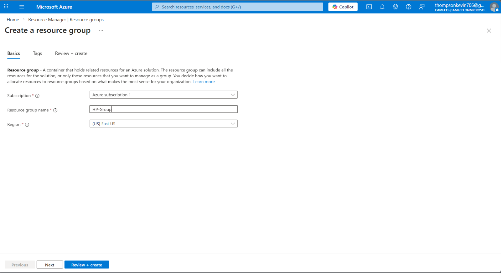

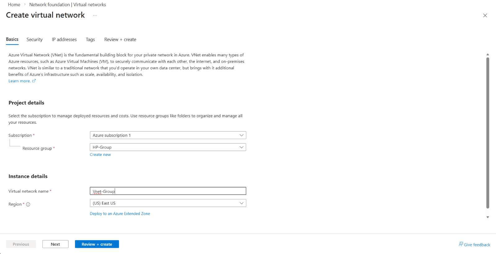

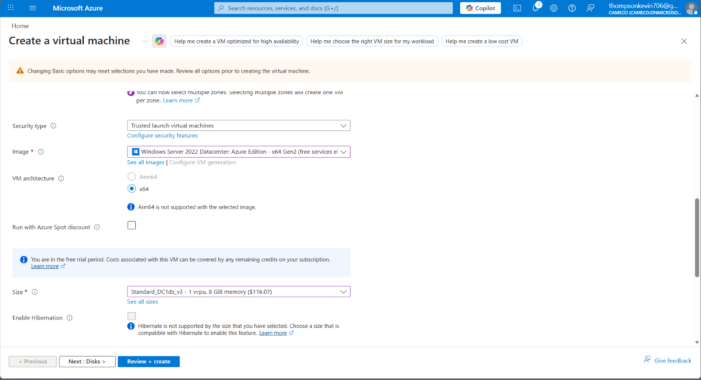

I intentionally disabled all the security settings when configuring this VM, deleted the default RDP firewall rule in the network security group, and created my own custom inbound rule to expose all the ports on the VM to increase the attack surface.

Using the remote desktop connection app, I logged on to my VM from my host machine and disabled the firewall. I then pinged the VM from my host machine to confirm its discoverability.

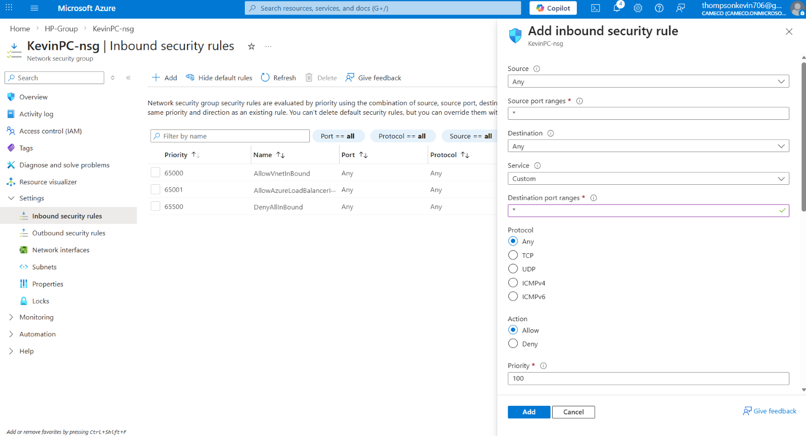

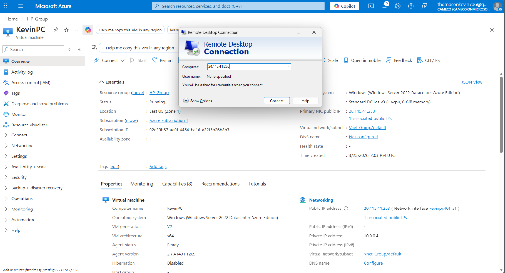

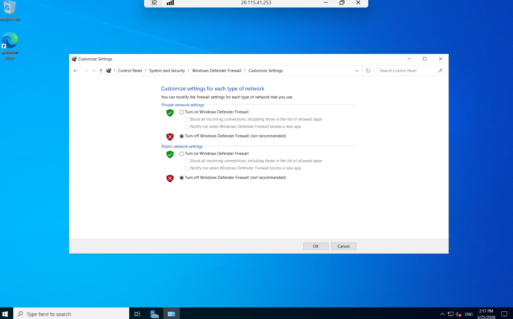

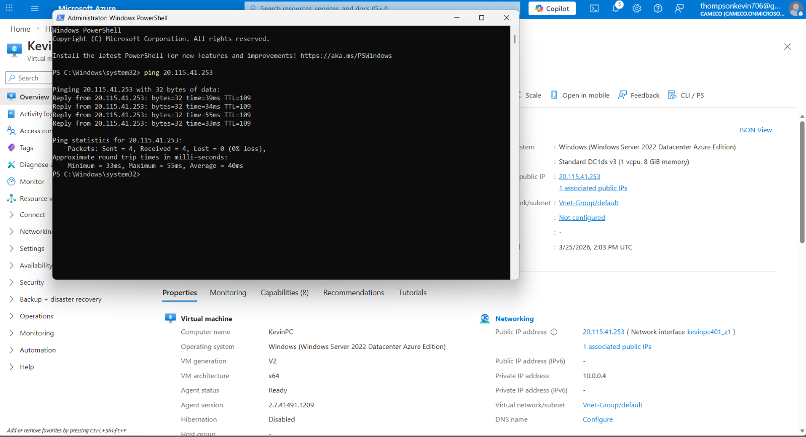

Back in Azure, I created a new Log Analytics Workspace, added this workspace to Microsoft Sentinel, installed Windows Security Events, and created a new data collection rule with my VM configured in the resources. After that, in the logs tab in the Log Analytic Workspace, I was able to view the Windows security events logs from my VM.

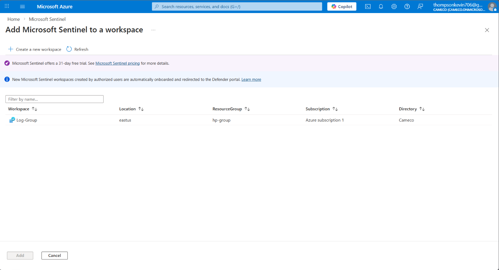

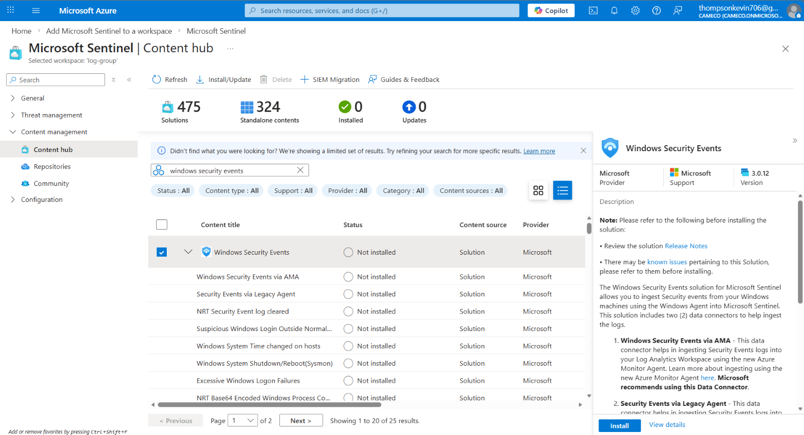

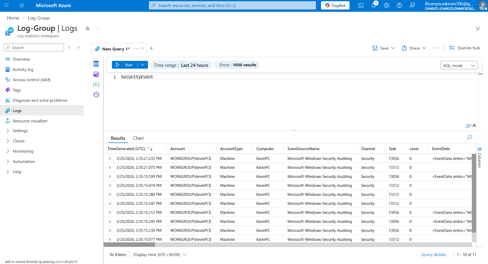

At this point, while I was letting some time pass for log collection, I tried to implement Josh's PowerShell script in the VM and configure the custom log. A few hours went by and I was still having trouble. I eventually decided to continue with HackTrace's method and saved the PowerShell script for another project.

After about five hours, I entered the following KQL query to filter for failed login attempts and to keep only the most relevant columns:

SecurityEvent | where EventID == 4625 | project TimeGenerated, IpAddress, Computer, Account, Activity, IpPort

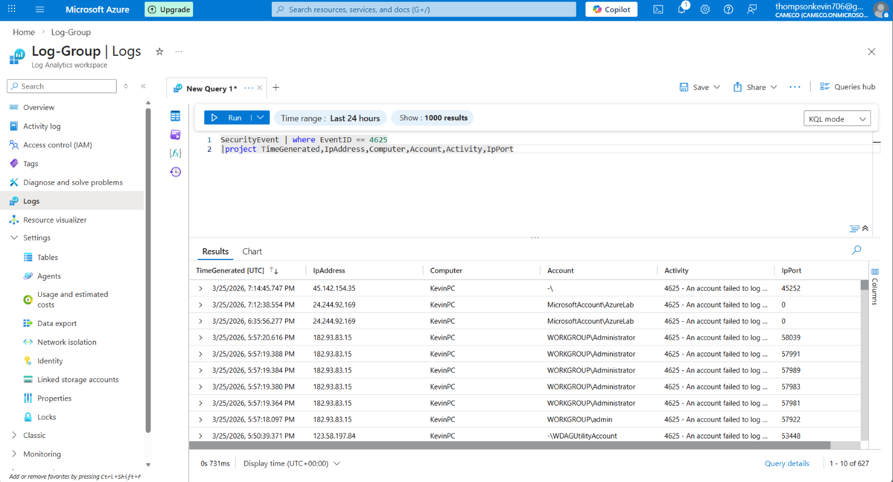

Finally, I exported the log data to a .csv file and with AI assistance, wrote a python script with my IPGeolocation API key to determine the origin countries, and sorted by the number of failed login attempts. (Note: the 2 attempts from Canada were by me, while I was trying to figure out the PowerShell script)

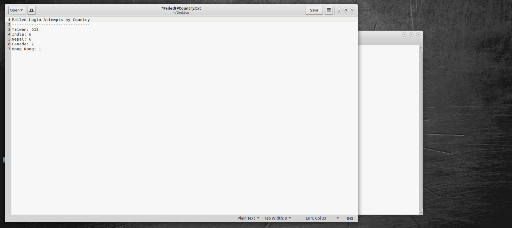

## Conclusions and Future Improvements:

For a very basic SIEM lab, I was able to observe just how quickly exposed systems are to target and some attempted brute-force login attempts from multiple countries. I was also able to see the use of common or generic usernames during password attacks (admin, administrator, user etc.). I wasn't able to configure this lab exactly how I wanted, but it was a great introduction to using the Microsoft Azure platform and their suite of products. There is much more to learn and experiment with.

In a future lab, I would like to be able to implement a PowerShell script like Josh did in his video, but in a JSON format, and figure out the proper configuration in the newer version of Azure. I want to see the results in live time, on a visual global map in Microsoft Sentinel. Finally, I would also like to run this lab for a longer time, perhaps a for a full day or two, to see how many more different IP's (and where they originate) attack my system.

